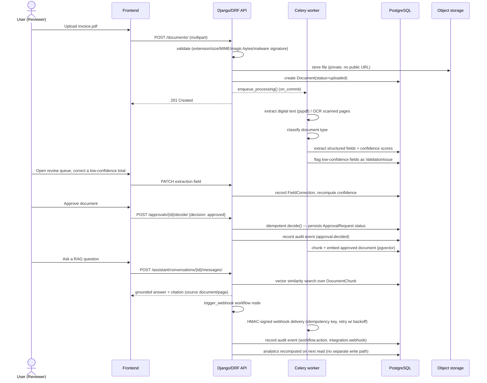
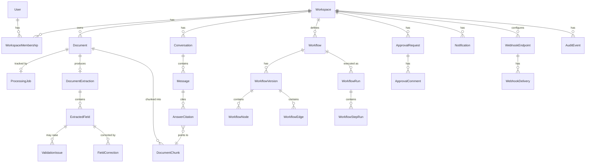

# Architecture Overview

DocPilot AI — Intelligent Document & Workflow Automation. **Portfolio
demonstration project.** Metrics, integrations, and workflows described
anywhere in this repository are illustrative/sample unless stated
otherwise.

See [`docs/adr/`](adr/) for the individual architectural decisions this
document assumes, most importantly
[ADR-0001](adr/0001-modular-monolith.md) (modular monolith, not
microservices).

> **Note on currency:** this document was last brought fully up to date
> at Phase 11 (production release). Earlier phases (Phase 3 onward)
> added `apps.documents`, `apps.processing`, `apps.extraction`,
> `apps.assistant`, `apps.workflows`, `apps.approvals`,
> `apps.notifications`, `apps.audit`, and `apps.analytics` — all
> reflected below. If a future change touches any of these modules
> without updating this file, treat this file as stale for that module
> and re-derive from the code (project rule: verify, don't assume).

## System shape

A single Django/DRF **modular monolith** backend, a single React/TypeScript
frontend, and asynchronous background processing via Celery/Redis. No
microservices.

```
┌─────────────────────┐       ┌────────────────────────────────────┐
│   frontend/ (Vite,   │  HTTP │   backend/ (Django + DRF)           │
│   React, TypeScript) │──────▶│   config/  — settings, URL root     │
└─────────────────────┘       │   apps/    — one Django app per     │
                               │             bounded module          │
                               │   common/  — cross-cutting infra    │
                               │             (logging, middleware,   │
                               │             error envelope)         │
                               └──┬──────────┬──────────┬───────────┘
                                  │          │          │
                          ┌───────▼──┐ ┌─────▼────┐ ┌───▼──────────┐
                          │PostgreSQL│ │  Redis    │ │ S3-compatible │
                          │(+pgvector│ │(cache,    │ │ object storage│
                          │for RAG   │ │Celery     │ │ (MinIO local, │
                          │embeddings│ │broker/    │ │ real S3 in    │
                          │)         │ │result     │ │ deployment)   │
                          │          │ │backend)   │ │               │
                          └──────────┘ └─────┬─────┘ └───────────────┘
                                              │
                                       ┌──────▼───────┐
                                       │ celery-worker │
                                       │ (OCR, extract,│
                                       │ embed, notify,│
                                       │ webhook)      │
                                       └───────────────┘
```

## Module boundaries

Each bounded piece of the product is its own Django app under
`backend/apps/`, not a separate service:

| App | Responsibility |
|---|---|
| `apps.health` | Liveness/readiness probes |
| `apps.accounts` | Custom user model (login by email), JWT auth |
| `apps.workspaces` | Workspace isolation, membership, RBAC, workspace settings (notification prefs, processing rules, retention) |
| `apps.documents` | Upload, secure S3-compatible storage, list/archive/delete |
| `apps.processing` | Async pipeline: digital-text extraction, per-page OCR routing, classification (Celery) |
| `apps.extraction` | Structured field extraction, confidence scoring, validation issues, human correction |
| `apps.assistant` | Semantic chunking/indexing (pgvector), RAG Q&A with citations |
| `apps.workflows` | Visual approval/automation workflow engine (nodes, edges, versioned runs) |
| `apps.approvals` | Approval-request lifecycle (assignment, comments, expiration, idempotent decisions) |
| `apps.notifications` | In-app notifications, signed/idempotent webhook delivery, log-only email adapter |
| `apps.audit` | Immutable, read-only audit-event log (no mutation path through any public API) |
| `apps.analytics` | Workspace-scoped operational aggregation over the modules above (no models of its own) |

Cross-cutting infrastructure — correlation-ID middleware, structured
logging, the stable API error envelope — lives in `backend/common/` and is
shared by every app. It never contains business logic (see the
non-negotiable rule keeping business logic out of views/serializers/tasks
— business rules belong in each app's own service/selector layer).

## Why a modular monolith, not microservices

See [ADR-0001](adr/0001-modular-monolith.md) for the full reasoning.
Short version: at this project's actual scale (a single team, a bounded
demo domain, no independently-demonstrated scaling requirement),
microservices would add deployment/operational complexity — network
boundaries, distributed transactions, service discovery — without a
matching benefit. Module boundaries are enforced by Django app boundaries
and code review instead, which is enough to keep the system navigable and
still leaves a real path to extraction later if a specific module ever
needs independent scaling.

## Request flow

1. Frontend calls the DRF API (`/api/...`).
2. `common.middleware.CorrelationIdMiddleware` attaches a correlation ID
   (reused from an inbound `X-Correlation-ID` header, or generated) to the
   request, echoed back on the response, and available to every log line
   emitted while handling the request.
3. The view delegates to a focused service/selector function for anything
   beyond request/response shaping (views stay thin).
4. Errors — validation, permission, not-found, or truly unexpected — all
   flow through `common.exceptions.stable_exception_handler`, which
   normalizes every error response to `{"error": {"code", "message",
   "details"}}` and ensures unhandled exceptions never leak internal
   detail to the client (logged server-side instead, with the correlation
   ID attached).

## Background processing

Celery workers (a dedicated `celery-worker` Docker Compose service,
consuming from Redis as broker and result backend) run everything that
must not block an HTTP request: document processing (text
extraction/OCR/classification), RAG embedding, and notification/webhook
delivery. Every task is idempotent (re-running one that partially
completed does not double-process a document or double-send a
notification); only genuinely retryable failures (provider timeout/
unavailable) retry, with exponential backoff and a fixed attempt cap —
validation failures (corrupt file, password-protected PDF) never retry.

## The primary demo flow, end to end



## Entity relationships (core, simplified)



Every workspace-scoped model carries (directly or transitively) a
`workspace` foreign key, and every workspace-scoped query filters on it
— see the "Workspace isolation" section below and
[`docs/adr`](adr/) for the permission model this enforces.

## Environments & configuration

Environment-based Django settings (`backend/config/settings/`):
`base` (shared, nothing environment-specific hardcoded) → `local` /
`test` / `production`. All environment-varying values (secrets, hosts,
database/broker/storage URLs) come from environment variables via
`django-environ`, never hardcoded. See
[`backend/README.md`](../backend/README.md) for the full settings-module
breakdown.

Time is handled in UTC internally throughout the backend
(`USE_TZ = True`, `TIME_ZONE = "UTC"`); conversion to a user's local time
zone is a presentation-layer concern only.

## Health & readiness

- `GET /api/health/` — liveness only, always 200 if the process can serve
  requests.
- `GET /api/readiness/` — checks PostgreSQL and Redis connectivity, 503 if
  either is unreachable. The response never includes the raw
  connection-error text — see `backend/apps/health/services.py`.

## Local & production infrastructure

- `docker-compose.yml` (repo root) — local development: PostgreSQL
  (`pgvector/pgvector` image), Redis, MinIO (+ one-shot bucket-init
  service), the backend (dev server, bind-mounted source), and
  `celery-worker`. The frontend runs via `npm run dev`, not
  containerized in this file.
- `docker-compose.prod.yml` (repo root) — production-parity manifest:
  gunicorn (backend), a separate worker process, nginx serving the
  built frontend, Postgres, Redis, MinIO/S3. No dev conveniences
  (bind-mounted source, `DEBUG=True`, insecure default secrets) — every
  secret-bearing value is required with no fallback, so an unset
  variable fails loudly instead of running insecurely. See
  `backend/Dockerfile.prod` and `frontend/Dockerfile` for the image
  builds and [`docs/DEPLOYMENT.md`](DEPLOYMENT.md) for the deployment
  process itself.

## Observability

- Structured (JSON) logs, one object per line, tagged with the request's
  correlation ID — see `backend/common/logging.py`. `StructuredFormatter`
  redacts any `extra` value whose key matches password/token/secret/
  api_key/authorization/credential as a defense-in-depth safety net,
  though callers remain primarily responsible for never logging those
  fields at all.
- Sentry wired but inert unless `SENTRY_DSN` is set
  (`backend/config/settings/production.py`).
- Never logged: secrets, tokens, passwords, full document contents,
  extracted field values.

## Further reading

- [`docs/security-assumptions.md`](security-assumptions.md) — trust
  boundaries, what's enforced vs. what's a documented assumption.
- [`docs/limitations.md`](limitations.md) — known gaps, honestly stated.
- [`docs/DEPLOYMENT.md`](DEPLOYMENT.md) — deployment process and
  rollback.
- [`docs/operations/`](operations/) — backup/recovery, release
  checklist.
- [`docs/portfolio-case-study.md`](portfolio-case-study.md) — the
  product/engineering narrative for this project as a portfolio piece.
- [`docs/adr/`](adr/) — individual architectural decisions.
